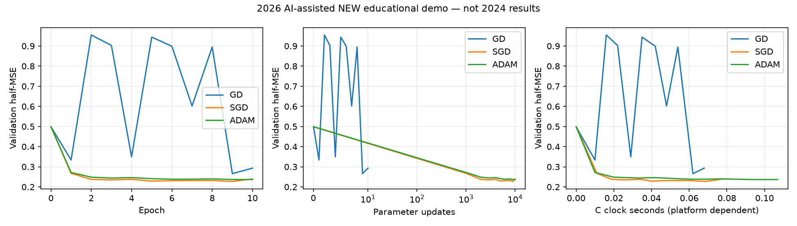

# GD, SGD and Adam: a C learning companion

This small experiment compares gradient descent (GD), stochastic gradient descent (SGD) and Adam on a binary Fashion-MNIST task. `optimizer.c` implements a single-layer model with a `tanh` output in C. `run_demo.py` prepares the data, compiles and runs the experiment, and creates plots and machine-readable results.

## Provenance

The historical project was a joint 2024 coursework project by **Ceyda Tolunay and Melih Baykal**. Its report is evidence of that shared work. The source files in this directory are a **new educational companion created on 2026-10-08 with AI assistance**. They are not recovered original source files, and this experiment does not reproduce the historical report's results. Metrics generated here describe this new demo; they are not evidence of Melih Baykal's individual performance or a personal achievement in 2024.

The historical report leaves two settings unresolved: the `CreateDataset` screenshot selects classes **1 and 6**, while the training screenshot selects **4 and 6**; the prose alternates between **40 test examples total** and **40 per class**, while the screenshot shows **20 per class**. This companion makes its own settings explicit instead of assuming which historical configuration produced the reported charts.

## Experiment

The data comes from the official [Fashion-MNIST repository](https://github.com/zalandoresearch/fashion-mnist). This companion uses class **0 (T-shirt/top)** and class **6 (Shirt)**. Images have 784 input pixels; each pixel is scaled by the fixed rule `pixel / 255`. This preprocessing has no statistics fitted on validation or test data.

| Setting | Default |
| --- | --- |
| Seed | `20261008` |
| Training examples | 500 per class; 1,000 total |
| Validation examples | 100 per class; 200 total |
| Test examples | 500 per class; 1,000 total |
| Training duration | 10 epochs |
| Model | One affine layer followed by `tanh` |
| Selection objective | Validation half-MSE: mean(0.5 × (prediction − target)²) |

Training and validation examples are disjoint subsets of Fashion-MNIST's official training split. Test examples come from its official test split. The test subset is held out during learning-rate selection. Each optimizer has its own validation learning-rate grid; the candidate with the lowest final-epoch validation half-MSE is selected before test evaluation. The candidate grids and selected settings are recorded by the runner rather than presented as universal defaults.

GD performs **one full-batch parameter update per epoch**. SGD and Adam perform **one parameter update per training sample**. An epoch therefore means the same number of training examples processed, but different numbers of parameter updates. Read epoch curves together with update counts and elapsed time. This experiment does not establish a universal ranking of optimizers or learning rates: it uses one seed, two classes, a small subset and one simple model. Runtime depends on the compiler and computer.

Adam follows the moment estimates and bias corrections described by Diederik P. Kingma and Jimmy Ba in [Adam: A Method for Stochastic Optimization](https://arxiv.org/abs/1412.6980).

## Run

Requirements: Python with NumPy and Matplotlib, a GCC-compatible C compiler, and network access for the initial Fashion-MNIST download. Run from this directory. Install dependencies in your Python environment if needed, then use the portable default work directory (`~/.cache/melih-optimizer-demo`):

```powershell
python -m pip install -r requirements.txt
python run_demo.py --gcc gcc
```

To state the default duration and seed explicitly, append:

```text
--epochs 10 --seed 20261008
```

Override `--work-dir` with an absolute directory outside the source tree, or `--gcc` with your compiler path as needed. The work directory holds downloaded data, prepared subsets, compiled executables and temporary run files. Generated result CSV files, PNG figures and `assets/run_summary.json` record the current run. `c_clock_seconds` is a platform-dependent C `clock()` measurement, not a claim of CPU time; `wall_seconds` uses Python's `perf_counter` and includes startup and data loading.

## Measured new demo run, 2026-10-08

These measurements belong only to the new AI-assisted companion. Each optimizer ran 10 epochs; its learning rate was selected using validation half-MSE before the test set was evaluated. The learning rates differ, and GD performs far fewer parameter updates. This small, single-seed run does not establish a general optimizer ranking.

| Optimizer | Selected LR | Updates | Validation accuracy | Test accuracy | Validation half-MSE | Test half-MSE |
| --- | ---: | ---: | ---: | ---: | ---: | ---: |
| GD | 0.1 | 10 | 81.0% | 79.7% | 0.293258 | 0.333620 |
| SGD | 0.001 | 10,000 | 83.0% | 83.0% | 0.239619 | 0.242758 |
| Adam | 0.0001 | 10,000 | 80.5% | 82.4% | 0.236524 | 0.240057 |



GD's selected learning rate produces oscillating validation loss in this narrow grid. Selection uses the final epoch; it does not claim monotonic convergence or a best historical configuration. Exact numerical values, timings, dataset checksums and verification results are in [the run summary](assets/run_summary.json). The table records the checked-in default run; custom seeds or epoch counts will produce different generated artifacts.

## Verification

The runner's verification covers:

- Analytical gradients against finite differences on a small deterministic fixture.
- Adam's first update against its bias-corrected formula.
- Repeated runs with the same seed, comparing numerical traces and model hashes. Elapsed time is excluded from equality checks.
- C compilation with `-Wall -Wextra` and checks that recorded losses are finite.

These checks verify the companion's implementation and repeatability within the tested environment. They do not resolve the historical report's ambiguous settings or certify reproduction of its charts. Compiler, platform or numeric-library changes may affect floating-point results.

## Data attribution

Fashion-MNIST is provided by Zalando Research under the [MIT license, copyright 2017 Zalando SE](https://github.com/zalandoresearch/fashion-mnist/blob/master/LICENSE). Retain the upstream license and copyright notice when redistributing its covered material. The dataset and Adam paper are external sources; this directory documents the new companion implementation separately from the jointly authored 2024 coursework.
