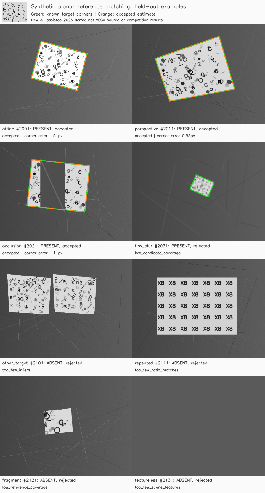

# Planar reference matching: a synthetic evaluation companion

A small CPU-only OpenCV experiment: locate one textured planar reference using ORB descriptors, Hamming-distance matching, a ratio test and a RANSAC homography. It measures object-presence decisions and corner localization against known synthetic geometry, including failures.

## Provenance and scope

This is a **new AI-assisted educational companion created on 8 October 2026**. It illustrates a narrow reference-matching problem related to the portfolio's computer vision theme. It is **not original VEGA source code, a reconstruction of the team's system, historical competition performance, or evidence of Melih Baykal's individual proficiency**. No competition images, recovered project code or external datasets are used. All textures and scenes are generated here from deterministic seeds.

The assumptions are deliberately limited: one known textured **planar** target, grayscale images, moderate viewpoint changes, and a single estimated quadrilateral. This does not reproduce segmentation, object identity across arbitrary 3D views, temporal reranking, aerial video, RGB/thermal fusion or an end-to-end competition task.

## Experiment

- Reference: one 300 × 240 px texture, seed `20261008`; scenes: 640 × 480 px.
- Development: 8 scenes with seeds `1001–1004` and `1101–1104`.
- Held-out test: 24 scenes with separate, explicitly listed seeds in `TEST_CASES`; 12 positive and 12 negative.
- Positives: scale/rotation/brightness changes, perspective distortion, a foreground strip spanning 30–50% of the target's bounding-box width, and small blurred targets.
- Negatives: two independent textures with the same drawing style, repeated glyph patterns, actual reference fragments, and one featureless image. A **fragment is labelled absent** because the complete reference object is missing. A fully present object partly hidden by an occluder is labelled present; this semantic difference is specified before evaluation.

All parameters, categories, seeds and the 8 px localization tolerance were fixed **before the first development or test run**. Neither split was used to tune parameters. Development scenes are a separate diagnostic set, not a fitted validation optimizer. The reference identity is shared between splits by design: the test holds out scene generation seeds, **not new object identities**. Sanity fixtures use separate seeds and known coordinates.

The matcher receives only the reference pixels, scene pixels and a deterministic RANSAC RNG seed. It never receives the presence label, generator homography, corner annotations or evaluation error. Ground truth is used afterward to measure results and draw green outlines.

### Fixed decision rules

ORB uses 1,800 requested features (`fastThreshold=12`, default binary descriptor settings). Two nearest neighbours are compared with a ratio threshold of `0.75`; each scene keypoint may contribute once. At least 12 matches are required. RANSAC uses a 3 px reprojection threshold, 2,000 iterations and confidence `0.995`.

An estimate needs at least 10 inliers, inlier ratio ≥ `0.45` and a reference inlier convex hull covering ≥ `18%` of reference pixels. Guards also reject empty or featureless inputs, degenerate spatial support, failed/nonfinite homographies, horizon-crossing or nonconvex/reflected quadrilaterals, implausible area and far-outside projections. These checks trade recall for conservative acceptance; they cannot prove that an accepted object is semantically complete.

### Metrics

Presence precision is `TP / (TP + FP)` and recall is `TP / (TP + FN)`. Acceptance determines presence; the corner tolerance does **not** change these classification counts. A false positive is an accepted negative scene. Rejected positive scenes are false negatives even when some features match.

For each **accepted positive** scene, corner error is the mean Euclidean distance in pixels between four estimated full-reference corners and their known generator positions, in the original 640 × 480 scene. This is an independent localization error, not the RANSAC fit residual. Rejected positives have no corner error; they remain in recall and in the localization-success denominator. Precision/recall with an empty denominator are saved as `null`.

## Run

Python 3.10+; no GPU, model weights, downloads or network calls during execution. From this directory:

```powershell
python -m venv .venv
.\.venv\Scripts\python.exe -m pip install -r requirements.txt
.\.venv\Scripts\python.exe run_demo.py
```

`--output PATH` writes elsewhere. The command runs nine sanity checks, both splits, and regenerates `cases.csv`, `run_summary.json` and `overview.png`. It overwrites these three output files. OpenCV is restricted to one CPU thread and OpenCL is disabled. Algorithm results were repeatable in the recorded environment; wall-clock timings vary by machine and load.

## Recorded new demo run

Measured on Windows 10, Python 3.12.14, NumPy 2.3.5 and OpenCV 4.13.0. These are synthetic demo results from 8 October 2026, not competition or real-world accuracy estimates.

| Split | Positive / negative | TP / FP / FN / TN | Precision | Recall |
| --- | ---: | ---: | ---: | ---: |
| Development | 4 / 4 | 3 / 0 / 1 / 4 | 100% | 75% |
| Held-out test | 12 / 12 | 8 / 0 / 4 / 12 | 100% | 66.7% |

On test, all eight accepted positives localized within the predeclared 8 px tolerance: **8 / 12 positive scenes**, not 8 / 8 successful detection trials as a recall claim. Their mean corner error was **0.937 px**, with a maximum of **1.511 px**. Zero false positives on only 12 synthetic negatives is limited evidence, not a guarantee on natural scenes.

| Test condition | Accepted / total | Interpretation |
| --- | ---: | --- |
| Scale, rotation, brightness | 3 / 3 positive | Localized successfully |
| Perspective | 3 / 3 positive | Localized successfully |
| Occlusion | 2 / 3 positive | One rejected for inadequate reference inlier coverage |
| Small target + blur | 0 / 3 positive | Too few distinctive matches or inadequate spatial coverage |
| Other same-style targets | 0 / 4 negative | RANSAC had too few inliers |
| Repeated glyphs | 0 / 3 negative | Ratio-match count below threshold |
| Reference fragments | 0 / 4 negative | Candidate/inlier coverage below threshold |
| Featureless scene | 0 / 1 negative | No usable scene features |

The occlusion failure (seed `2023`) had 44 tentative matches and 30 RANSAC inliers, but they covered only **3.80%** of the reference. This illustrates why a large match count alone is insufficient. Small blurred scenes (`2031–2033`) failed because feature evidence was sparse or concentrated. Thresholds were kept unchanged after observing these failures.

Reference feature preparation took **24.6 ms**. Test matching, including scene ORB extraction, descriptor matching and geometry checks, took **42.2 ms median** and **77.1 ms p95**. These timings exclude scene generation and output rendering. Recorded computation through overview-image generation and writing, including sanity checks and synthetic generation, took **3.23 s**; this excludes final JSON/CSV serialization and process startup. These are single-process demonstration measurements, not a flight-platform benchmark.



The overview displays the first test seed in each predeclared category, including an unsuccessful positive. It is illustrative; every scene and rejection reason is available in [cases.csv](cases.csv), with full quadrilaterals, configuration and runtime information in [run_summary.json](run_summary.json).

## Verification and limitations

Nine checks passed: exact translation coordinates, empty and featureless scenes, empty and featureless references, collinear correspondences, a nonfinite homography, localization of a separate known quadrilateral, and rejection of independent unrelated targets. The separate known-quadrilateral fixture had **0.652 px** mean corner error. These checks validate basic input/geometry behaviour and an independently specified target, not all adversarial cases.

This small procedural generator shares a texture family and an interpolation pipeline across splits. It does not test camera noise, natural background distributions, nonplanarity, repeated real-world logos, multiple valid target instances, mirror views, heavy motion blur or long video sequences. ORB may fail on textureless objects; local fragments can still fool a geometric matcher under other layouts. The conservative coverage rule can also reject valid heavily occluded targets, as the recorded test shows. New algorithm choices would require a new untouched test set before claiming an improved held-out result.

## Primary technical references

- [OpenCV: Feature Matching](https://docs.opencv.org/4.x/dc/dc3/tutorial_py_matcher.html) — ORB binary descriptors, Hamming matching and nearest-neighbour ratio filtering.
- [OpenCV: Feature Matching + Homography](https://docs.opencv.org/4.x/d1/de0/tutorial_py_feature_homography.html) — planar homography estimation with RANSAC and projection of reference corners.

The implementation and synthetic artwork were generated for this companion; the documentation links explain the underlying OpenCV APIs, not the measured results.
